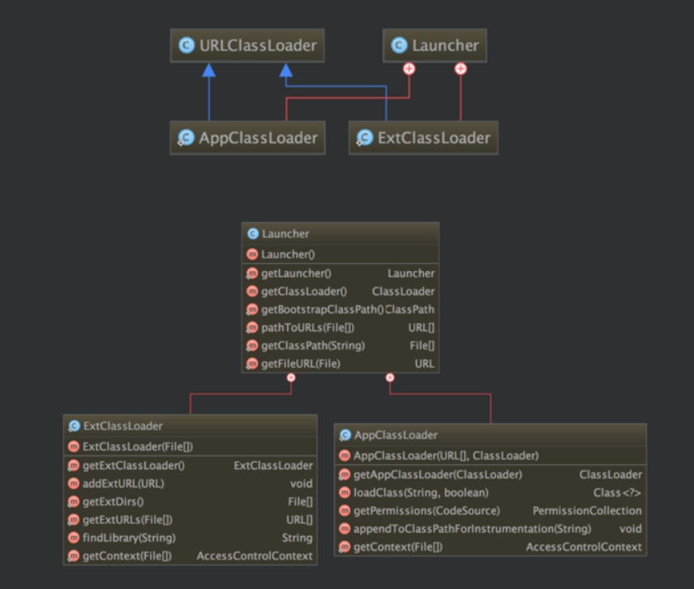

## 面试题

深入分析ClassLoader（蚂蚁金服）

## ClassLoader与现有类加载器的关系


ClassLoader是一个抽象类。如果我们给定了一个类的二进制名称，类加载器应尝试去定位或生成构成定义类的数据。一种典型的策略是将给定的二进制名称转换为文件名，然后去文件系统中读取这个文件名所对应的class文件。 

## ClassLoader的主要方法

抽象类ClassLoader的主要方法：(内部没有抽象方法)

- public final ClassLoader getParent()

  返回该类加载器的超类加载器

- public Class<?> loadClass(String name) throws ClassNotFoundException

  加载名称为name的类，返回结果为java.lang.Class类的实例。如果找不到类，则返回 ClassNotFoundException 异常。该方法中的逻辑就是双亲委派模式的实现。

- protected Class<?> findClass(String name) throws ClassNotFoundException

  查找二进制名称为name的类，返回结果为java.lang.Class类的实例。这是一个受保护的方法，JVM鼓励我们重写此方法，需要自定义加载器遵循双亲委托机制，该方法会在检查完父类加载器之后被loadClass()方法调用。

在JDK1.2之前，在自定义类加载时，总会去继承ClassLoader类并重写loadClass方法，从而实现自定义的类加载类。但是在JDK1.2之后已不再建议用户去覆盖loadClass()方法，而是建议把自定义的类加载逻辑写在findClass()方法中，从前面的分析可知，findClass()方法是在loadClass()方法中被调用的，当loadClass()方法中父加载器加载失败后，则会调用自己的findClass()方法来完成类加载，这样就可以保证自定义的类加载器也符合双亲委托模式。

需要注意的是ClassLoader类中并没有实现findClass()方法的具体代码逻辑，取而代之的是抛出ClassNotFoundException异常，同时应该知道的是findClass方法通常是和defineClass方法一起使用的。<font color = 'red'>一般情况下，在自定义类加载器时，会直接覆盖ClassLoader的findClass()方法并编写加载规则，取得要加载类的字节码后转换成流，然后调用defineClass()方法生成类的Class对象。</font>

- protected final Class<?> defineClass(String name, byte[] b, int off, int len)

  根据给定的字节数组b转换为Class的实例，off和len参数表示实际Class信息在byte数组中的位置和长度，其中byte数组b是ClassLoader从外部获取的。这是受保护的方法，只有在自定义ClassLoader子类中可以使用。

defineClass()方法是用来将byte字节流解析成JVM能够识别的Class对象(ClassLoader中已实现该方法逻辑)，通过这个方法不仅能够通过class文件实例化class对象，也可以通过其他方式实例化class对象，如通过网络接收一个类的字节码，然后转换为byte字节流创建对应的Class对象。

<font color = 'red'>defineClass()方法通常与findClass()方法一起使用，一般情况下，在自定义类加载器时，会直接覆盖ClassLoader的findClass()方法并编写加载规则，取得要加载类的字节码后转换成流，然后调用defineClass()方法生成类的Class对象</font>

简单举例：

```java
protected Class<?> findClass(String name) throws ClassNotFoundException {
    // 获取类的字节数组
    byte[] classData = getClassData(name);
    if (classData == null) {
        throw new ClassNotFoundException();
    } else {
        //使用defineClass生成class对象
        return defineClass(name, classData, 0, classData.length);
    }
}
```

- protected final void resolveClass(Class<?> c)

  链接指定的一个Java类。使用该方法可以使用类的Class对象创建完成的同时也被解析。前面我们说链接阶段主要是对字节码进行验证，为类变量分配内存并设置初始值同时将字节码文件中的符号引用转换为直接引用。

- protected final Class<?> findLoadedClass(String name)

  查找名称为name的已经被加载过的类，返回结果为java.lang.Class类的实例。这个方法是final方法，无法被修改。

- private final ClassLoader parent;

  它也是一个ClassLoader的实例，这个字段所表示的ClassLoader也称为这个ClassLoader的双亲。在类加载的过程中,ClassLoader可能会将某些请求交予自己的双亲处理。

 ### loadClass()的剖析

```java
测试代码：
ClassLoader.getSystemClassLoader().loadClass("com.luojia.java.User");
 
涉及到对如下方法的调用：
protected Class<?> loadClass(String name, boolean resolve) //resolve:true-加载class的同时进行解析操作。
    throws ClassNotFoundException{
    synchronized (getClassLoadingLock(name)) { //同步操作，保证只能加载一次。
        //首先，在缓存中判断是否已经加载同名的类。
        Class<?> c = findLoadedClass(name);
        if (c == null) {
            long t0 = System.nanoTime();
            try {
               //获取当前类加载器的父类加载器。
                if (parent != null) {
                    //如果存在父类加载器，则调用父类加载器进行类的加载
                    c = parent.loadClass(name, false);
                } else { //parent为null:父类加载器是引导类加载器
                    c = findBootstrapClassOrNull(name);
                }
            } catch (ClassNotFoundException e) {
                // ClassNotFoundException thrown if class not found
                // from the non-null parent class loader
            }

            if (c == null) { //当前类的加载器的父类加载器未加载此类 or 当前类的加载器未加载此类
                // 调用当前ClassLoader的findClass()
                long t1 = System.nanoTime();
                c = findClass(name);

                // this is the defining class loader; record the stats
                sun.misc.PerfCounter.getParentDelegationTime().addTime(t1 - t0);
                sun.misc.PerfCounter.getFindClassTime().addElapsedTimeFrom(t1);
                sun.misc.PerfCounter.getFindClasses().increment();
            }
        }
        if (resolve) {//是否进行解析操作
            resolveClass(c);
        }
        return c;
    }
}
```

## SecureClassLoader 与 URLClassLoader

接着SecureClassLoader扩展了 ClassLoader，新增了几个与使用相关的代码源(对代码源的位置及其证书的验证)和权限定义类验证(主要指对class源码的访问权限)的方法，一般我们不会直接跟这个类打交道，更多是与它的子类URLClassLoader有所关联。

前面说过，ClassLoader是一个抽象类，很多方法是空的没有实现，比如 findClass()、findResource()等。而URLClassLoader这个实现类为这些方法提供了具体的实现。并新增了URLClassPath类协助取得Class字节码流等功能。<font color = 'red'>在编写自定义类加载器时，如果没有太过于复杂的需求，可以直接继承URLClassLoader类</font>，这样就可以避免自己去编写findClass()方法及其获取字节码流的方式，使自定义类加载器编写更加简洁。

 

## ExtClassLoader 与 AppClassLoader

了解完URLClassLoader后接着看看剩余的两个类加载器，即拓展类加载器ExtClassLoader和系统类加载器AppClassLoader，这两个类都继承自URLClassLoader，是sun.misc.Launcher的静态内部类。sun.misc.Launcher主要被系统用于启动主应用程序，ExtClassLoader和AppClassLoader都是由sun.misc.Launcher创建的，其类主要类结构如下：



我们发现ExtClassLoader并没有重写loadClass()方法，这足矣说明其遵循双亲委派模式，而AppClassLoader重载了loadClass()方法，但最终调用的还是父类loadClass()方法，因此依然遵守双亲委派模式。

 ## Class.forName()与ClassLoader.loadClass()对比

- Class.forName()：是一个静态方法,最常用的是Class.forName(String className);根据传入的类的全限定名返回一个 Class 对象。<font color = 'red'>该方法在将 Class 文件加载到内存的同时,会执行类的初始化。</font>如: Class.forName("com.luojia.java.HelloWorld");

- ClassLoader.loadClass()：这是一个实例方法，需要一个 ClassLoader 对象来调用该方法。<font color = 'red'>该方法将 Class 文件加载到内存时，并不会执行类的初始化，直到这个类第一次使用时才进行初始化。</font>该方法因为需要得到一个 ClassLoader 对象,所以可以根据需要指定使用哪个类加载器。
      如：ClassLoader cl=.......;    
      cl.loadClass("com.atguigu.java.HelloWorld");


