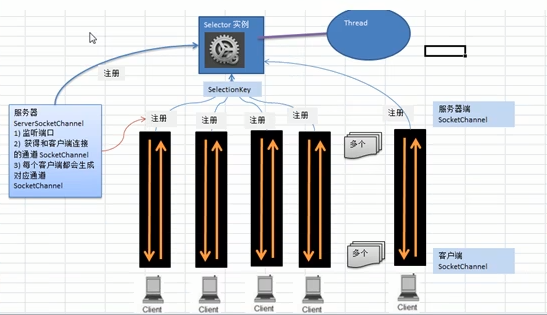

# Selector 选择器

### 基本介绍

1)Java 的 NIO，用非阻塞的IO 方式。可以用一个线程，处理多个的客户端连接，就会使用到Selector(选择器)

<font color = 'red'>2)Selector 能够检测多个注册的通道上是否有事件发生(注意:多个Channel以事件的方式可以注册到同一个Selector)</font>，如果有事件发生，便获取事件然后针对每个事件进行相应的处理。这样就可以只用一个单线程去管理多个通道，也就是管理多个连接和请求。

3)只有在 连接/通道 真正有读写事件发生时，才会进行读写，就大大地减少了系统开销，并且不必为每个连接都创建一个线程，不用去维护多个线程

4)避免了多线程之间的上下文切换导致的开销

#### 特点说明

1）Netty的IO 线程 NioEventLoop 聚合了 Selector(选择器，也叫多路复用器)，可以同时并发处理成百上千个容户端连接。

2）当线程从某客户端 Socket 通道进行读写数据时，若没有数据可用时，该线程可以进行其他任务。

3）线程通常将非阻塞IO的空闲时间用于在其他通道上执行I0操作，所以单独的线程可以管理多个输入和输出通道。

4）由于读写操作都是非阻塞的，这就可以充分提升 IO线程的运行效率，避免由于频繁 IO阻塞导致的线程挂起。

5）一个I/O线程可以并发处理N个客户端连接和读写操作，这从根本上解决了传统同步阻塞I/O一连接一线程模型，架构的性能、弹性伸缩能力和可靠性都得到了极大的提升。

### NIO非阻塞网络编程原理分析图

NIO非阻塞网络编程相关的(Selector、SelectionKey、ServerSocketChannel和SocketChannel)关系梳理



对上图的说明：

1. 当客户端连接时，会通过ServerSocketChannel得到SocketChannel
2. Selector开始监听
3. 将SocketChannel 注册到Selector上，调用register(Selector sel, int ops)，一个Selector上可以注册多个SocketChannel
4. 注册后返回一个SelectionKey，会和该Selector关联(集合关系)
5. Selector实例进行监听 select方法，返回有事件发生的通道个数
6. 进一步得到各个selectionKey（有事件发生的selectionKey）
7. 在通过SelectionKey 反向获取到SocketChannel ，方法：Channel()
8. 通过得到的 SocketChannel，完成业务处理

NIOServer

```java
package com.luojia.netty.nettypro.nio;

import java.io.IOException;
import java.net.InetSocketAddress;
import java.nio.ByteBuffer;
import java.nio.channels.*;
import java.util.Iterator;
import java.util.Set;

public class NIOServer {
    public static void main(String[] args) throws IOException {
        // 创建ServerSocketChannel -> serverSocket
        ServerSocketChannel serverSocketChannel = ServerSocketChannel.open();
        // 得到一个Selector 对象
        Selector selector = Selector.open();
        // 绑定一个端口6666，在服务端监听
        serverSocketChannel.socket().bind(new InetSocketAddress(6666));
        // 设置为非阻塞
        serverSocketChannel.configureBlocking(false);
        // 把 serverSocketChannel 注册到Selector 关心事件为 OP_ACCEPT
        serverSocketChannel.register(selector, SelectionKey.OP_ACCEPT);

        // 循环等待客户链接
        while (true) {
            // 非阻塞，立即返回
            // if (selector.selectNow() == 0) {
            // select,阻塞指定时间毫秒，无链接就阻塞指定时间返回
            if (selector.select(1000) == 0) {
                System.out.println("服务器等待了1秒，无连接");
                continue;
            }

            // 如果返回的 >0，就获取到了selectionKey集合
            // 1.如果返回大于0，表示已经获取到了关注的集合
            // 2.selector.selectedKeys()返回关注时间的集合
            Set<SelectionKey> selectionKeys = selector.selectedKeys();
            // 通过 selectionKeys 反向获取通道
            Iterator<SelectionKey> keyIterator = selectionKeys.iterator();
            while (keyIterator.hasNext()) {
                SelectionKey key = keyIterator.next();
                // 根据key，对应的通道发生的事件做相应的处理
                if (key.isAcceptable()) {
                    // serverSocketChannel的accept()是不阻塞的
                    SocketChannel sockerChannel = serverSocketChannel.accept();
                    sockerChannel.configureBlocking(false);
                    // 将SocketChannel 注册到Selector，关注事件为 OP_READ
                    sockerChannel.register(selector, SelectionKey.OP_READ, ByteBuffer.allocate(1024));
                }
                // 发生事件 OP_READ
                if (key.isReadable()) {
                    // 通过key，反向获取到Channel
                    SocketChannel socketChannel = (SocketChannel)key.channel();
                    // 获取到该Channel关联的Buffer
                    ByteBuffer buffer = (ByteBuffer)key.attachment();
                    socketChannel.read(buffer);
                    System.out.println("form 客户端 " + new String(buffer.array()));
                }

                // 手动从集合中移动当前的selectionKey，防止迭代器中重复遍历
                keyIterator.remove();
            }
        }
    }
}
```

NIOClient

```java
package com.luojia.netty.nettypro.nio;

import java.io.IOException;
import java.net.InetSocketAddress;
import java.nio.ByteBuffer;
import java.nio.channels.SocketChannel;

public class NIOClient {
    public static void main(String[] args) throws IOException {
        // 得到一个网络通道
        SocketChannel socketChannel = SocketChannel.open();
        // 设置非阻塞
        socketChannel.configureBlocking(false);
        // 绑定服务器ip和端口
        InetSocketAddress inetSocketAddress = new InetSocketAddress("127.0.0.1", 6666);
        // 连接服务器
        if (!socketChannel.connect(inetSocketAddress)) {
            while (!socketChannel.finishConnect()) {
                System.out.println("暂未连接上服务器，客户端不会阻塞，可以做其他操作");
            }
        }

        // 如果链接成功，发送数据
        String str = "连接成功，发送数据";
        // ByteBuffer buffer = ByteBuffer.allocate(1024);
        ByteBuffer buffer = ByteBuffer.wrap(str.getBytes());
        socketChannel.write(buffer);
        // 让客户端停留在此处
        System.in.read();
    }
}
```


